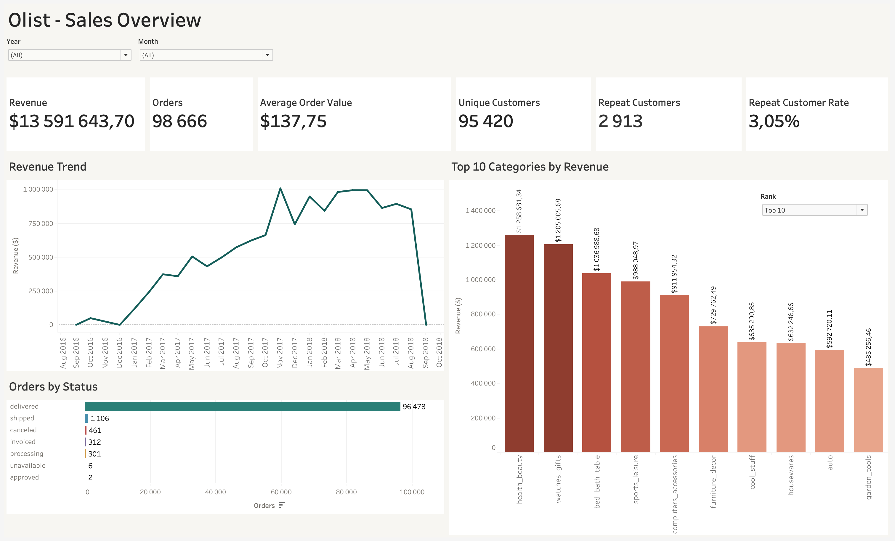
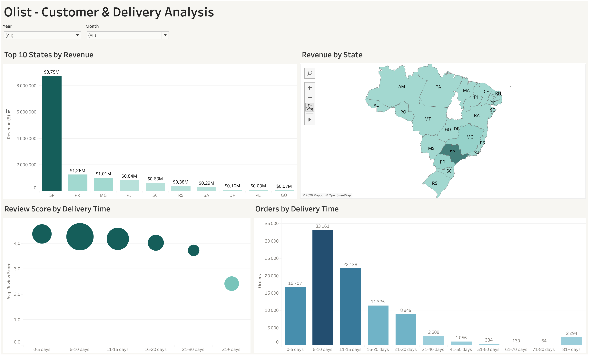

# Olist E-commerce Sales & Customer Analysis

## Project Overview

This project analyzes sales, customer behavior, delivery performance, product categories, seller geography, order statuses, and customer reviews for Olist, a Brazilian e-commerce marketplace.

The project covers the full analytics workflow: data preparation and validation in MySQL, business metric calculation, exploratory analysis, and interactive dashboard development in Tableau.

The main goal is to identify key sales and customer patterns and evaluate how operational factors, such as delivery time, are associated with customer satisfaction.

---

## Business Questions

- How does revenue change over time?
- Which product categories generate the most revenue?
- Which Brazilian states generate the most revenue?
- What is the average order value?
- How many customers make repeat purchases?
- How are orders distributed by delivery time?
- Is delivery time associated with customer review scores?
- What is the distribution of order statuses?
- How does customer behavior differ between one-time and repeat customers?

---

## Dataset

The project uses the Brazilian E-Commerce Public Dataset by Olist, a Brazilian e-commerce marketplace dataset containing approximately 100,000 orders placed between September, 2016 and October, 2018.

The dataset includes information about:

- orders
- order items
- customers
- products
- sellers
- payments
- reviews
- geolocation
- product categories

The analysis combines data from multiple source tables to create a consolidated analytical dataset for SQL analysis and Tableau visualization.

---

## Data Preparation

The source data was loaded into MySQL and prepared for analysis using SQL.

Key data preparation steps included:

- validating row counts and data consistency across source tables
- joining orders with order items, customers, products, sellers, and reviews
- identifying orders without associated product items
- cleaning seller state values
- translating product categories into English
- calculating delivery time in days
- aggregating review scores at the order level
- preparing a consolidated analytical dataset for Tableau

### Order Definition

For the main analysis, an order is counted only when it contains at least one product item.

This excludes orders without associated product items from the main order KPI and ensures that order-level metrics are based on transactions with available product data.

The resulting analytical dataset contains **98,666 orders with product items**.

---

## Revenue Definition

For this project, **Revenue** is defined as the sum of product prices (`price`).

Freight costs are excluded from Revenue and analyzed separately.

This approach keeps product sales value separate from shipping costs and provides a consistent basis for revenue analysis across the dashboards.

---

## Key Metrics

| KPI | Value |
|---|---:|
| Revenue | $13,591,643.70 |
| Orders | 98,666 |
| Average Order Value | $137.75 |
| Unique Customers | 95,420 |
| Repeat Customers | 2,913 |
| Repeat Customer Rate | 3.05% |

The metrics are calculated from the consolidated analytical dataset described above. KPI definitions are kept consistent across the SQL analysis and Tableau dashboards.

---

## Analysis

### Revenue Trend

Revenue was analyzed over time to identify changes in sales activity across the available period.

The dataset covers the period from September 2016 to October 2018. Year-over-year comparisons should take into account that 2016 and 2018 represent partial calendar years.

### Product Categories

Revenue was analyzed by product category to identify the categories contributing the most to total sales.

The analysis also takes into account product categories with missing English translations rather than excluding these records from the dataset.

### Geographic Analysis

Revenue was analyzed by Brazilian state to identify the geographic distribution of sales and the states generating the highest revenue.

A filled map provides an overview of the geographic distribution, while a Top 10 states view highlights the largest contributors.

### Customer Behavior

Customer behavior was analyzed using unique customers, orders per customer, repeat customers, repeat customer rate, and repeat customers by order count.

A repeat customer is defined as a customer who placed two or more orders during the observed period.

The analysis helps evaluate customer retention and the extent to which sales are generated by returning customers.

### Delivery Performance

Delivery performance was analyzed using the number of days between order purchase and delivery.

Orders were grouped into delivery-time ranges to understand the distribution of delivery durations.

Delivery time was also compared with average customer review scores to examine whether longer delivery times are associated with lower customer satisfaction.

### Order Status

Orders were analyzed by order status to understand the operational distribution of the marketplace.

The analysis includes delivered, shipped, canceled, unavailable, invoiced, processing, created, and approved orders.

---

## Tableau Dashboards

### Dashboard 1 — Sales Overview

The first dashboard provides an overview of marketplace sales performance and customer activity.

It includes:

- Revenue
- Orders
- Average Order Value
- Unique Customers
- Repeat Customers
- Repeat Customer Rate
- Revenue Trend
- Revenue by Product Category
- Orders by Status
- Orders by Delivery Time



### Dashboard 2 — Customer & Delivery Analysis

The second dashboard focuses on customer behavior, geographic distribution, delivery performance, and customer satisfaction.

It includes:

- Revenue by Brazilian State
- Repeat Customers by Order Count
- Average Review Score by Delivery Time
- Revenue vs. Review Score



[View Interactive Dashboard on Tableau Public](https://public.tableau.com/app/profile/ludmila.kuznetsova/viz/Olist_Dashboard_17912843175040/SalesAnalysis)

---

## Key Findings

- Revenue reached $13.6M across the analytical dataset.
- Customer retention is relatively low: only 3.05% of customers made two or more purchases during the observed period.
- Revenue is concentrated among a limited number of product categories and Brazilian states.
- The majority of orders were successfully delivered, while canceled and unavailable orders represent a smaller share of total orders.
- Longer delivery times are associated with lower average customer review scores.
- Most customers made only one purchase during the observed period, indicating a relatively low level of repeat purchasing.

---

## Tools & Skills

- **MySQL** — data preparation, validation, joins, aggregations, CTEs, calculated metrics
- **SQL** — business logic, KPI calculation, customer and order analysis
- **Tableau** — interactive dashboards, calculated fields, filters, maps, tooltips, data visualization
- **Data Analysis** — sales analysis, customer behavior, delivery performance, review analysis, geographic analysis
- **GitHub** — project documentation and portfolio presentation

---

## Project Structure

```text
olist-ecommerce-analysis/
├── README.md
├── data/
│   └── olist_analytics.csv
├── sql/
│   └── olist_analytics.sql
├── tableau/
│   └── Olist_Dashboard.twbx
└── images/
    ├── olist_sales_overview.png
    └── olist_customer_and_delivery_analysis.png
```

---

## Conclusion

This project demonstrates an end-to-end data analytics workflow, from data preparation and SQL analysis to business metric calculation and interactive Tableau dashboard development.

The analysis focuses on sales performance, customer behavior, delivery performance, geographic distribution, and customer satisfaction.

The project highlights how SQL and Tableau can be combined to transform raw e-commerce data into actionable business insights.
